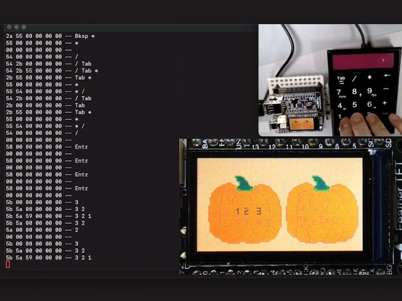
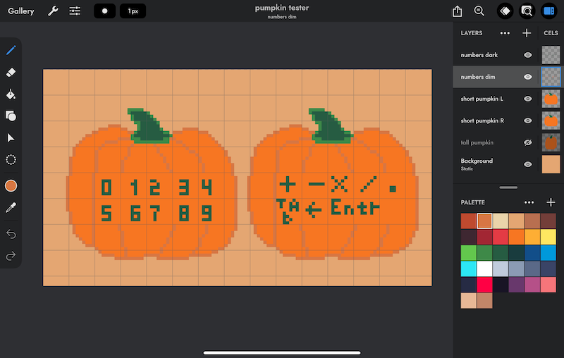
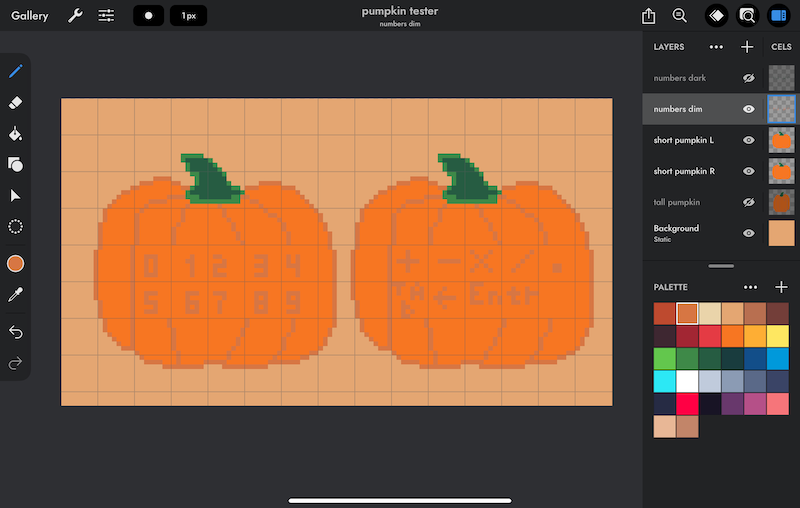
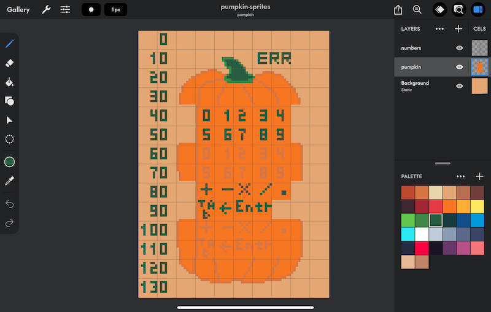

<!-- SPDX-License-Identifier: MIT -->
<!-- SPDX-FileCopyrightText: Copyright 2024 Sam Blenny -->
# Pumpkin Numpad Tester

It's almost Fall, so here's a pumpkin themed numeric keypad tester. The display
uses CircuitPython displayio TileGrid sprites to indicate key presses. Details
of the USB HID reports get logged to the serial console. The hardware is an
ESP32-S3 Feather TFT, a MAX3421E USB Host FeatherWing, and a Perixx USB numeric
keypad.

## Hardware

### Parts

- Adafruit ESP32-S3 TFT Feather - 4MB Flash, 2MB PSRAM
  ([product page](https://www.adafruit.com/product/5483),
  [learn guide](https://learn.adafruit.com/adafruit-esp32-s3-tft-feather))

- Adafruit USB Host FeatherWing with MAX3421E
  ([product page](https://www.adafruit.com/product/5858),
  [learn guide](https://learn.adafruit.com/adafruit-usb-host-featherwing-with-max3421e))

- Adafruit FeatherWing Doubler
  ([product page](https://www.adafruit.com/product/2890))

- USB wired numeric keypad such as the Perixx PPD-202
  ([product page](https://perixx.com/products/peripad-202-wired-usb-numerical-keypad-non-synchronized-function-shortcut-keys-large-print))

### Pinouts

| TFT feather | USB Host | ST7789 TFT |
| ----------- | -------- | ---------- |
|  SCK        |  SCK     |            |
|  MOSI       |  MOSI    |            |
|  MISO       |  MISO    |            |
|  D9         |  IRQ     |            |
|  D10        |  CS      |            |
|  TFT_CS     |          |  CS        |
|  TFT_DC     |          |  DC        |

### Tools and Consumables

You will need soldering tools and solder.

### Soldering the Headers

The TFT Feather, USB Host FeatherWing and the Doubler all come in kit form, so
you will need to solder the headers.

If you are unfamiliar with soldering headers, you might want to read:

- [Adafruit Guide To Excellent Soldering](https://learn.adafruit.com/adafruit-guide-excellent-soldering/tools)

- [How To Solder Headers](https://learn.adafruit.com/how-to-solder-headers)

## Sprites

I made these sprites in the Pixaki 4 app for iPad. The idea is that the text
gets darker when you press the corresponding keys on the numeric keypad. The
first two images show how the light and dark text will look on the screen. The
third image shows a zoomed in view of the actual spritesheet. All the grid
lines in the screenshots are set for 8x8 pixels. I use these screenshots to
write the code for arranging `displayio.TileGrid` sprites.

### Screenshot of Dark Text Pumpkins

### Screenshot of Light Text Pumpkins

### Screenshot of Spritesheet

## Updating CircuitPython

**NOTE: To update CircuitPython on the ESP32-S3 TFT Feather with 2MB PSRAM and
4MB Flash, you need to use the .BIN file (combination bootloader and
CircuitPython core)**

1. Download the CircuitPython 9.1.4 **.BIN** file from the
   [Feather ESP32-S3 TFT PSRAM](https://circuitpython.org/board/adafruit_feather_esp32s3_tft/)
   page on circuitpython.org

2. Follow the instructions in the
   [Web Serial ESPTool](https://learn.adafruit.com/circuitpython-with-esp32-quick-start/web-serial-esptool)
   section of the "CircuitPython on ESP32 Quick Start" learn guide to update
   your board with CircuitPython 9.1.3. First erasing the board's contents,
   then programming it with the .BIN file.

## Installing CircuitPython Code

To copy the project bundle files to your CIRCUITPY drive:

1. Download the project bundle .zip file using the button on the Playground
   guide or the attachment download link on the GitHub repo Releases page.

2. Expand the zip file by opening it, or use `unzip` in a Terminal. The zip
   archive should expand to a folder. When you open the folder, it should
   contain a `README.txt` file and a `CircuitPython 9.x` folder.

3. Open the CircuitPython 9.x folder and copy all of its contents to your
   CIRCUITPY drive.

To learn more about copying libraries to your CIRCUITPY drive, check out the
[CircuitPython Libraries](https://learn.adafruit.com/welcome-to-circuitpython/circuitpython-libraries)
section of the
[Welcome to CircuitPython!](https://learn.adafruit.com/welcome-to-circuitpython)
learn guide.
